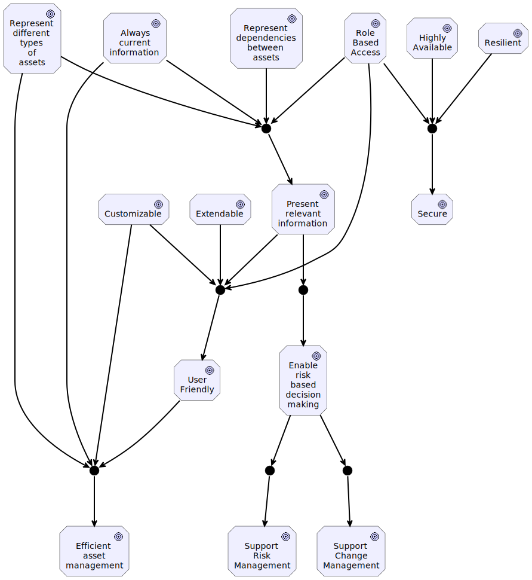
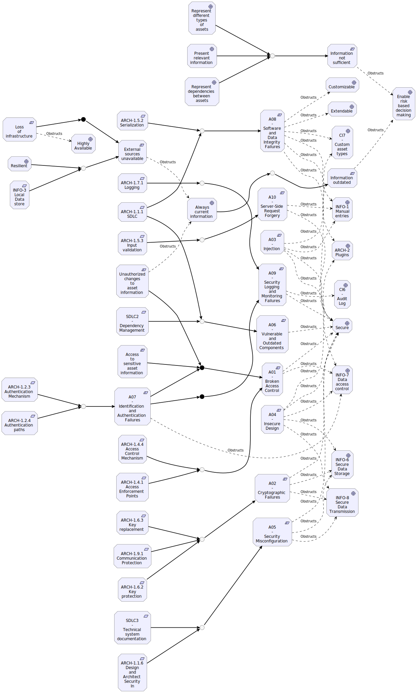
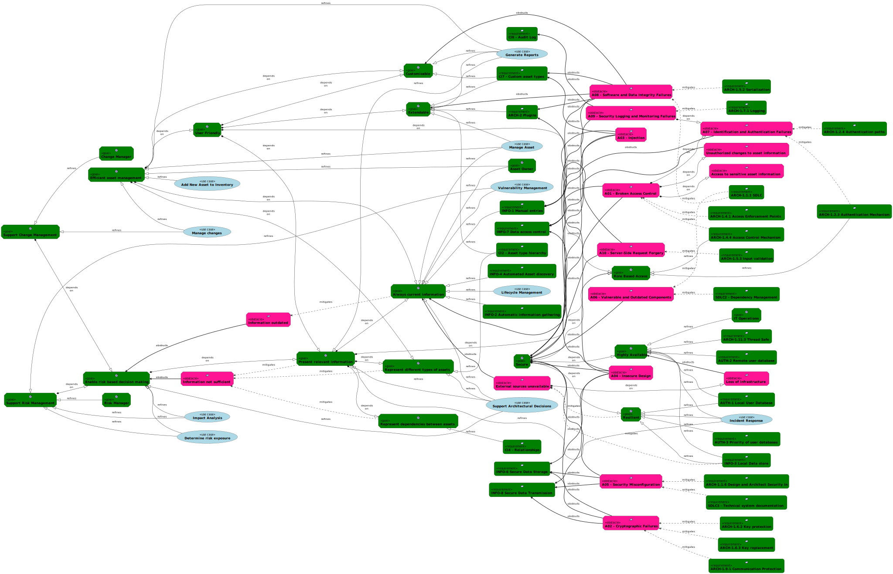

Introduction
============

Background
----------

Projektet har i syfte om att utveckla en Asset Inventory åt Knowit
Cybersecurity & Law. Tanken är en modulbaserad webapplikation som är
flexibel och smidig att använda för att en organisation ska snabbt kunna
identifiera och kategorisera sina IT-tillgångar.

Strategic Goals
---------------

Systemet ska kunna inhämta, uppdatera och presentera information om
tillgångar i IT-miljön samt eventuella beroenden mellan tillgångarna.

\* Automatisk inhämtning och uppdatering

\* Beroendeanalys

\* Scenario Impact Simulation

Scope
-----

Huvudsakligt fokus ligger på att utveckla själva bas-systemet med
funktionalitet för att hantera tillgångar i IT-miljön och erbjuda ett
användargränssnitt för detta. Då ett mål är att lätt kunna utöka
funktionaliteten kommer dock några moduler för t.ex. datainhämtning att
behöva utvecklas.

Goals
=====

Overview
--------

{height="150mm"}

Customizable
------------

To improve usability for different stakeholders and support the business
as far as possible the application must be customizable in various
aspects.

Always current information
--------------------------

To improve the utility of the application the information contained must
be kept updated and current.

Present relevant information
----------------------------

Different stakeholders will be interested in different information
regarding an asset, the application must be able to filter out what
information is relevant for a specific stakeholder to avoid information
overload.

Highly Available
----------------

To avoid downtime when needed the application must be built so it can be
deployed in an high availability configuration.

Enable risk based decision making
---------------------------------

To be able to take decisions based on risk, sufficient information about
assets criticality is needed

Resilient
---------

In the face of malfunction the application should recover to normal
operation as fast as possible and adapt to handle similar events in the
future.

Role Based Access
-----------------

Different users need access to different views and functionality in the
application. To be able to control this role based access to the system
and the information should be used.

Efficient asset management
--------------------------

To improve productivity and ability to allocate relevant resources it is
vital that the enterprise is able manage it\'s assets in an efficient
manner.

Represent different types of assets
-----------------------------------

To maximise the ability to provide relevant information about assets,
the applikation must be able to represent different types of assets with
different properties.

Represent dependencies between assets
-------------------------------------

No asset exists in isolation, to improve the ability to analyse the
components of a system the application must be able to represent
different types of dependencies between assets.

Extendable
----------

To improve portability and usability the applikation should be easily
extendable with modules or plug-ins, for instance to change
authentication mechanism or add methods for collecting data about an
asset type.

Secure
------

Since the information contained in the system might be sensitive the
system must be as secure as possible. Access-control, accounting and
ensuring integrity of data is especially important.

User Friendly
-------------

The application must be user friendly and intuitive to use.

Aspects of user interface and workflow must be considered.

Support Change Management
-------------------------

To be able to securely perform changes in the operating environment it
must be possible to determine what impact a change might cause on other
systems.

Support Risk Management
-----------------------

To efficiently manage risks it must be possible to determine what
threats and vulnerabilities that is present in the environment and how
exposed the environment is.

Obstacles
=========

Overview
--------

{height="150mm"}

Integrity\_Threat: Information outdated
---------------------------------------

The information in the inventory does not reflect the current reality.

Integrity\_Threat: Unauthorized changes to asset information
------------------------------------------------------------

Changes can be made to stored information in such way that the new
information does not reflect the reality any more.

Integrity\_Threat: A08 -- Software and Data Integrity Failures
--------------------------------------------------------------

Software and data integrity failures relate to code and infrastructure
that does not protect against integrity violations. An example of this
is where an application relies upon plugins, libraries, or modules from
untrusted sources, repositories, and content delivery networks (CDNs).
An insecure CI/CD pipeline can introduce the potential for unauthorized
access, malicious code, or system compromise. Lastly, many applications
now include auto-update functionality, where updates are downloaded
without sufficient integrity verification and applied to the previously
trusted application. Attackers could potentially upload their own
updates to be distributed and run on all installations. Another example
is where objects or data are encoded or serialized into a structure that
an attacker can see and modify is vulnerable to insecure
deserialization.

Demands: Information not sufficient
-----------------------------------

The information available in the inventory is not sufficient for the
stakeholder to perform it\'s work, making it necessary to consult
external sources for the information

Availability\_Threat: External sources unavailable
--------------------------------------------------

External information sources is unavailable, for instance due to network
outage.

Availability\_Threat: Loss of infrastructure
--------------------------------------------

Full, or partial, loss of infrastructure such as network devices and
storage nodes.

Confidentiality\_Threat: Access to sensitive asset information
--------------------------------------------------------------

The inventory will contain information that is sensitive, for instance
known vulnerabilities and internal documentation.

Confidentiality\_Threat: A02 -- Cryptographic Failures
------------------------------------------------------

The first thing is to determine the protection needs of data in transit
and at rest. For example, passwords, credit card numbers, health
records, personal information, and business secrets require extra
protection, mainly if that data falls under privacy laws, e.g., EU\'s
General Data Protection Regulation (GDPR), or regulations, e.g.,
financial data protection such as PCI Data Security Standard (PCI DSS).

Accountability\_Threat: A09 -- Security Logging and Monitoring Failures
-----------------------------------------------------------------------

Without logging and monitoring, breaches cannot be detected.
Insufficient logging, detection, monitoring, and active response occurs
any time:

\* Auditable events, such as logins, failed logins, and high-value
transactions, are not logged.

\* Warnings and errors generate no, inadequate, or unclear log messages.

\* Logs of applications and APIs are not monitored for suspicious
activity.

\* Logs are only stored locally.

\* Appropriate alerting thresholds and response escalation processes are
not in place or effective.

\* Penetration testing and scans by dynamic application security testing
(DAST) tools (such as OWASP ZAP) do not trigger alerts.

\* The application cannot detect, escalate, or alert for active attacks
in real-time or near real-time.

Threat: A01 -- Broken Access Control
------------------------------------

Access control enforces policy such that users cannot act outside of
their intended permissions.

Failures typically lead to unauthorized information disclosure,
modification, or destruction of all data or performing a business
function outside the user\'s limits.

Threat: A07 -- Identification and Authentication Failures
---------------------------------------------------------

Confirmation of the user\'s identity, authentication, and session
management is critical to protect against authentication-related
attacks.

Threat: A03 -- Injection
------------------------

Some of the more common injections are SQL, NoSQL, OS command, Object
Relational Mapping (ORM), LDAP, and Expression Language (EL) or Object
Graph Navigation Library (OGNL) injection. The concept is identical
among all interpreters.

An application is vulnerable to attack when:

\* User-supplied data is not validated, filtered, or sanitized by the
application.

\* Dynamic queries or non-parameterized calls without context-aware
escaping are used directly in the interpreter.

\* Hostile data is used within object-relational mapping (ORM) search
parameters to extract additional, sensitive records.

\* Hostile data is directly used or concatenated. The SQL or command
contains the structure and malicious data in dynamic queries, commands,
or stored procedures.

Threat: A04 -- Insecure Design
------------------------------

Insecure design is a broad category representing different weaknesses,
expressed as "missing or ineffective control design." There is a
difference between insecure design and insecure implementation; we
differentiate between design flaws and implementation defects for a
reason, they have different root causes and remediation. A secure design
can still have implementation defects leading to vulnerabilities that
may be exploited. An insecure design cannot be fixed by a perfect
implementation as by definition, needed security controls were never
created to defend against specific attacks.

Threat: A05 -- Security Misconfiguration
----------------------------------------

The application might be vulnerable if the application is:

\* Missing appropriate security hardening across any part of the
application stack or improperly configured permissions on cloud
services.

\* Unnecessary features are enabled or installed (e.g., unnecessary
ports, services, pages, accounts, or privileges).

\* Default accounts and their passwords are still enabled and unchanged.

\* Error handling reveals stack traces or other overly informative error
messages to users.

\* For upgraded systems, the latest security features are disabled or
not configured securely.

\* The security settings in the application servers, application
frameworks (e.g., Struts, Spring, ASP.NET), libraries, databases, etc.,
are not set to secure values.

\* The server does not send security headers or directives, or they are
not set to secure values.

\* The software is out of date or vulnerable

Without a concerted, repeatable application security configuration
process, systems are at a higher risk

Threat: A06 -- Vulnerable and Outdated Components
-------------------------------------------------

You are likely vulnerable:

\* If you do not know the versions of all components you use (both
client-side and server-side). This includes components you directly use
as well as nested dependencies.

\* If you do not fix or upgrade the underlying platform, frameworks, and
dependencies in a risk-based, timely fashion. This commonly happens in
environments when patching is a monthly or quarterly task under change
control, leaving organizations open to days or months of unnecessary
exposure to fixed vulnerabilities.

\* If you do not secure the components' configurations (see
A05:2021-Security Misconfiguration).

Threat: A10 - Server-Side Request Forgery
-----------------------------------------

SSRF flaws occur whenever a web application is fetching a remote
resource without validating the user-supplied URL. It allows an attacker
to coerce the application to send a crafted request to an unexpected
destination, even when protected by a firewall, VPN, or another type of
network access control list (ACL).

As modern web applications provide end-users with convenient features,
fetching a URL becomes a common scenario. As a result, the incidence of
SSRF is increasing. Also, the severity of SSRF is becoming higher due to
cloud services and the complexity of architectures.

Use Cases
=========

Overview
--------

{height="200mm"}

UC1: Add New Asset to Inventory
-------------------------------

**Actor.**

Asset Owner

**Description.**

Add a new asset to the inventory.

**Pre-Conditions.**

Asset not present in inventory

**Steps.**

1.  Generate unique asset identificator

2.  Register mandatory asset information, such as asset owner,
    criticality and financial information

3.  Provide information from external sources

4.  Register dependencies to other assets

**Post-Conditions.**

Asset present in inventory

UC2: Determine risk exposure
----------------------------

**Actor.**

Risk Manager

**Description.**

Continously monitor the risk exposure of the organisation by assessing
the risks present for systems and assets.

**Pre-Conditions.**

Hard to determine risk exposure due to manual labour.

**Steps.**

1.  Gather information about current threat landscape and potential
    threat agents

2.  Determine what assets affected by which threat

3.  Determine what assets that is exposed to threat agents (internal and
    external)

4.  Calculate risk based on asset criticality and threat severity

5.  Determine exposure based on reachability to affected asset

**Post-Conditions.**

Easy to determine risk exposure due to automation.

UC8: Vulnerability Management
-----------------------------

**Actor.**

Information Security Manager

Risk Manager

**Description.**

Support the finding, prioritization and remidiation of vulnerabilities.

**Pre-Conditions.**

No visibility into the severity and criticality of vulnerabilities
affecting assets

**Steps.**

1.  Gather asset information, such as CPE or Package URL

2.  Gather information about reported vulnerabilities affecting the
    assets

3.  Determine how an asset is affected by a vulnerability and calculate
    severity, e.g. by using the environment section of CVSS

4.  Find and document possible remediational actions

5.  Follow up remediation status

**Post-Conditions.**

Visibility into the severity and criticality of vulnerabilities
affecting assets and steps to remidiate them

UC3: Generate Reports
---------------------

**Actor.**

Asset Owner

Information Security Manager

Risk Manager

Product Owner

IT Operations

Incident Response Lead

**Description.**

Different stakeholder will want to generate different kinds of reports
freom the application.

Incident response managers will, for instance, be able to create reports
with disaster recovery procedures and vulnerability managers will want
reports regarding known vulnerabilities.

**Pre-Conditions.**

No report generated

**Steps.**

1.  Select which asset, group of assets or asset type the report will be
    based on

2.  Select type of report or create custom type

3.  Select fields to use for populating the report with information.

4.  Collect information based on selections

5.  Generate report in a user selected format (PDF, Word, Excel, Json,
    XML etc)

**Post-Conditions.**

Report generated

UC7: Manage Asset
-----------------

**Actor.**

Asset Owner

Product Owner

**Description.**

Changes to the environment or the asset itself must be reflected in the
information about the asset so it is current.

Some properties will change frequently while others might be static
during the asset lifetime.

**Pre-Conditions.**

Outdated record in inventory

**Steps.**

1.  Find asset

2.  Fetch updates from remote sources

    1.  Exception External source unavailable: External information
        sources might not be available

3.  Present current information and fill in new information

4.  Store changed fields

    1.  Exception Primary storage not available: The primary storage is
        unavailable

**Post-Conditions.**

Updated record in inventory

UC6: Lifecycle Management
-------------------------

**Actor.**

Asset Owner

**Description.**

An asset will go through different states during it\'s life time, as an
example; a system will can be under development, in test, in production
and decommissioned.

The actual lifecycle states might differ between asset types.

**Pre-Conditions.**

\-

**Steps.**

1.  Find asset or create asset

2.  Read current lifecycle status

3.  Change status to a valid value

4.  Store change

5.  Trig any external processes connected to the new status

**Post-Conditions.**

\-

UC4: Impact Analysis
--------------------

**Actor.**

Risk Manager

IT Operations

**Description.**

To be able to make risk based decisions the impact of an outtake of or
change to an asset must be determined.

Since assets has links to other assets, the effect on these assets must
be taken into consideration during that process.

**Pre-Conditions.**

Impact undetermined

**Steps.**

1.  Determine direct impact on the asset

2.  Determine how the impact on the main asset affect linked assets

**Post-Conditions.**

Impact determined

UC5: Incident Response
----------------------

**Actor.**

Incident Response Lead

**Description.**

Determine what assets is affected by an incident, what support groups
should handle the incident and escalation points and follow the
respective assets incident response plans and escalation chains.

**Pre-Conditions.**

Incindent has been registered with, at least, information where and how
the issue manifest itself for end-users.

**Steps.**

1.  Categorize incident

2.  Identify primary asset affected

3.  Use asset dependencies to identify assets affected

4.  Determine the urgency of the incident based on assets affected and
    incident charactheristics

5.  Determine the impact based on affected asset(s)

6.  Prioritize based on urgency and impact

7.  Determine if incident task force must be formed or if ordinary
    support groups is to be used

8.  Assign incident to relevant support group (e.g. DevOps-team,
    technicians, system vendor)

9.  Retrieve incident handling documentation for affected assets

10. Retrive known issues related to affected assets

11. Ensure escalation points has been notified and is on stand by

12. Initiate incident remidiation and change management process

13. Report incident handling progress continously

**Post-Conditions.**

Incident resolved or mitigated

UC9: Support Architectural Decisions
------------------------------------

**Actor.**

Enterprise Architect

**Description.**

Architecture on different levels, i.e. enterprise, infrastructure,
system and application, must be anchored in what the enterprise as a
whole strives for and what assets and capabilities that is available to
reach these goals.

To support the architectural work it is vital to be able to determine
what assets that is currently available in the enterprise and their
dependencies.

**Pre-Conditions.**

None

**Steps.**

1.  Gather information on relevant available assets

2.  Identify stakeholders

3.  Conduct impact analysis

4.  Identify Options and Evaluate Alternatives

5.  Analyze Risk and Reward for each available option

6.  Select the Preferred Option

**Post-Conditions.**

Architectural decision documented and communicated.

UC10: Manage changes
--------------------

**Actor.**

Asset Owner

Product Owner

IT Operations

Change Manager

**Description.**

Reduced Disruptions to Business Operations: Effective change management
minimizes disruptions to business operations by planning and
implementing changes carefully.

Improved IT Service Quality: By minimizing the risk of failures and
incidents, IT change management helps improve the overall quality of IT
services.

Reduced Cost of Change: By preventing costly mistakes and rework,
effective change management can save organizations money over time.

Increased Agility and Adaptability: By having a structured and
repeatable process for change, organizations can be more agile and
adaptable to changing business needs.

**Pre-Conditions.**

Change Request created

**Steps.**

1.  Identify assets affected by the change

2.  Asses risks regarding the change

3.  Assess potential impacts of the change, both positive and negative

4.  Determine feasibility of the change

5.  Identify needed resources for deploying the change

6.  Change request accepted

    1.  Exception Reject Change Request: If the change is deemed to
        risky, unfeasible or too costly the request is rejected and this
        use case is ended.

7.  Develop change plan

8.  Schedule change

9.  Deploy change

**Post-Conditions.**

Change deployed

Requirements
============

Overview
--------

{height="150mm"}

CI1 - Unique Identifier (Data)
------------------------------

**Priority.**

1

**Description.**

\*Unique Identifier\*

All assets must be assigned a unique identifier that is automatically
generated during creation of the record.

The format of the identifier should be customizable depending on the
type of asset.

**Originator.**

ITIL

CI2 - Asset type hierarchy (Data)
---------------------------------

**Priority.**

1

**Description.**

\*Asset type hierarchy\*

Assets must be assigned a main type (such as hardware, software, data)
and a more granular subtype (e.g. server, laptop). An asset may be
assigned sub-sub-types (or deeper if appropriate).

**Originator.**

ITIL

CI3 - Attributes (Data)
-----------------------

**Priority.**

1

**Description.**

\*Attributes\*

All assets must have a set of attribute-fields that is common across
different asset types, including but not limited to Unique id, name,
description, modification history and asset owner.

Further fields will be determined by asset type, sub-type and available
information modules.

Available attributes should be possible to customize.

**Originator.**

ITIL

CI4 - Relationships (Data)
--------------------------

**Priority.**

1

**Description.**

\*Relationships\*

Relationships between assets must be possible to specify, for instance
\"X is a component of Y\", \"Y uses Z\".

Custom relation types should be possible to define.

**Originator.**

ITIL

CI5 - Mandatory attributes (Functional)
---------------------------------------

**Priority.**

2

**Description.**

\*Mandatory attributes\*

It must be possible to define a set of mandatory attributes for all
assets, it should be possible to define mandatory attributes specific
for asset types.

**Originator.**

ITIL

CI7 - Custom asset types (Functional)
-------------------------------------

**Priority.**

2

**Description.**

\*Custom asset types\*

It should be possible to define custom asset types.

The custom type can be either a toplevel main type or a subtype to an
existing main or sub-type

**Originator.**

KCL

AUTH-2 Remote user database (Functional)
----------------------------------------

**Priority.**

2

**Description.**

\*Remote user database\*

The application must support the use of external user management such as
LDAP and AD.

The remote service MUST handle authentication and MAY handle
authorization.

**Originator.**

KCL

INFO-4 Automated Asset discovery (Functional)
---------------------------------------------

**Priority.**

2

**Description.**

\*Automated Asset discovery\*

It should be possible to automate the creation of assets in the
inventory by reading data from external sources, or by using internal
modules.

**Originator.**

KCL

INFO-5 Disable Automatic Information Gathering (Functional)
-----------------------------------------------------------

**Priority.**

2

**Description.**

It must be possible to disable automatic information gathering for a
given asset.

**Rationale.**

If the automation for some reason does not work, manual entries must not
be overwritten with faulty input from the automation.

**Originator.**

KCL

CI6 - Audit Log (Functional)
----------------------------

**Priority.**

1

**Description.**

All modifications made must be traceable and show who did the change and
when the change was made.

It should be possible to produce a diff-view of the change showing
changed fields and their old and new values.

**Originator.**

ITIL

AUTH-1 Local User Database (Functional)
---------------------------------------

**Priority.**

1

**Description.**

A local user database must be provided that allow users to sign in.

The database must contain credentials and assigned roles to allow
authentication, access control and auditing to work.

**Rationale.**

If a central authentication solution, such as LDAP or AD, is unavailable
it must be possible to authenticate to the system and use it.

**Originator.**

KCL

INFO-1 Manual entries (Functional)
----------------------------------

**Priority.**

1

**Description.**

\*Manual entries\*

It must be possible to enter information about an asset manually into
the system.

**Originator.**

KCL

INFO-2 Automatic information gathering (Functional)
---------------------------------------------------

**Priority.**

1

**Description.**

\*Automatic information gathering\*

The application must support automatic information gathering from
different external sources.

**Rationale.**

Some information about an asset will change for various reasons,
examples is known vulnerabilities and which version of an application a
host is running.

Maintaining this kind of information manually is cumbersome and should
be avoided.

**Originator.**

KCL

INFO-7 Data access control (Functional)
---------------------------------------

**Priority.**

1

**Description.**

Access to asset information must be possible to control with various
levels of granularity.

**Rationale.**

Depending on role and resposibilities, different data and possible
actions must be available to the user.

For instance; the asset owner must be able to change the information
about an asset, while a developer only need read access to some specific
fields.

**Originator.**

KCL

INFO-8 Secure Data Transmission (Functional)
--------------------------------------------

**Priority.**

1

**Description.**

All communications to and from the application must be protected against
eavesdropping and manipulation using suitable encryption methods.

**Originator.**

KCL

AUTH-3 Priority of user databases (Functional)
----------------------------------------------

**Priority.**

3

**Description.**

\*Priority of user databases\*

With multiple user databases configured the application must use them in
order for authentication.

The first mathing user id must be used for credential validation.

**Rationale.**

If a user-id exist in all configured databases it must not be possible
to exploit differences between the databases to gain access. Therefore
the search must stop at the first match on user-id and not on credential
validation.

**Originator.**

KCL

INFO-6 Secure Data Storage (Security)
-------------------------------------

**Priority.**

2

**Description.**

Data at rest must be encrypted with algorithms that provide both
confidentiality and integrity

**Originator.**

KCL

ARCH-1.1.3 Features and User stories (Security)
-----------------------------------------------

**Priority.**

2

**Description.**

\*Features and User stories\*

All user stories and features must contain functional security
constraints, such as:

\"As a user, I should be able to view and edit my profile. I should not
be able to view or edit anyone else\'s profile\"

**Originator.**

ASVS 4.0.3

ARCH-1.1.2 Threat modeling (Security)
-------------------------------------

**Priority.**

2

**Description.**

Threat modeling should be performed for every design change and sprint
planning to identify threats, plan for countermeasures, facilitate
appropriate risk responses, and guide security testing.

**Originator.**

ASVS 4.0.3

ARCH-1.2.2 Component Communication (Security)
---------------------------------------------

**Priority.**

2

**Description.**

Communications between application components, including APIs,
middleware and data layers, must be authenticated. Components must have
the least necessary privileges needed.

**Originator.**

ASVS 4.0.3

ARCH-1.2.3 Authentication Mechanism (Security)
----------------------------------------------

**Priority.**

2

**Description.**

The application must use a single vetted authentication mechanism that
is known to be secure, can be extended to include strong authentication,
and has sufficient logging and monitoring to detect account abuse or
breaches.

**Originator.**

ASVS 4.0.3

ARCH-1.4.4 Access Control Mechanism (Security)
----------------------------------------------

**Priority.**

2

**Description.**

The application must use a single and well-vetted access control
mechanism for accessing protected data and resources. All requests must
pass through this single mechanism to avoid copy and paste or insecure
alternative paths.

**Originator.**

ASVS 4.0.3

ARCH-1.7.1 Logging (Security)
-----------------------------

**Priority.**

2

**Description.**

\*Logging\*

A common logging format and approach must be used across the system.

**Originator.**

ASVS 4.0.3

ARCH-1.11.2 Unsynchronized state (Security)
-------------------------------------------

**Priority.**

2

**Description.**

\*Unsynchronized state\*

High-value logic flows, including authentication, session management and
access control, must not share unsynchronized state.

**Originator.**

ASVS 4.0.3

ARCH-1.14.1 Segregation (Security)
----------------------------------

**Priority.**

2

**Description.**

Enforce segregation of components of differing trust levels through
well-defined security controls, firewall rules, API gateways, reverse
proxies, cloud-based security groups, or similar mechanisms.

**Originator.**

ASVS 4.0.3

ARCH-1.6.2 Key protection (Security)
------------------------------------

**Priority.**

2

**Description.**

\*Key protection\*

Consumers of cryptographic services must protect key material and other
secrets by using key vaults or API based alternatives.

**Originator.**

ASVS 4.0.3

ARCH-1.6.3 Key replacement (Security)
-------------------------------------

**Priority.**

2

**Description.**

\*Key replacement\*

Cryptographic keys and passwords must be replaceable and must be part of
a well-defined process to re-encrypt sensitive data.

**Originator.**

ASVS 4.0.3

ARCH-1.1.6 Design and Architect Security In (Security)
------------------------------------------------------

**Priority.**

1

**Description.**

Security controls must be centralized, simple (economy of design),
vetted, secure, and reusable to avoid duplicate, missing, ineffective,
or insecure controls.

**Rationale.**

An insecure design cannot be fixed by a perfect implementation as by
definition, needed security controls were never created to defend
against specific attacks. One of the factors that contribute to insecure
design is the lack of business risk profiling inherent in the software
or system being developed, and thus the failure to determine what level
of security design is required.

**Originator.**

ASVS 4.0.3

ARCH-1.1.1 SDLC (Security)
--------------------------

**Priority.**

1

**Description.**

The development process must follow a secure software development
lifecycle that addresses security in all stages of development. Make
secure coding checklist, security requirements, guideline, or policy
available to all developers and testers.

Verify that the build pipeline warns of out-of-date or insecure
components and takes appropriate actions.

Verify the application does not use unsupported, insecure, or deprecated
client-side technologies such as NSAPI plugins, Flash, Shockwave,
ActiveX, Silverlight, NACL, or client-side Java applets.

**Originator.**

ASVS 4.0.3

ARCH-1.2.4 Authentication paths (Security)
------------------------------------------

**Priority.**

1

**Description.**

All authentication pathways and identity management APIs must implement
consistent authentication security control strength, such that there are
no weaker alternatives.

**Originator.**

ASVS 4.0.3

ARCH-1.4.1 Access Enforcement Points (Security)
-----------------------------------------------

**Priority.**

1

**Description.**

Access controls must be enforced on a trusted layer and not on a
untrusted, i.e. on the client-side.

**Originator.**

ASVS 4.0.3

ARCH-1.5.2 Serialization (Security)
-----------------------------------

**Priority.**

1

**Description.**

\*Serialization\*

Serialization should not be used when communicating with untrusted
clients.

If this is not possible, ensure that adequate integrity controls (and
possibly encryption if sensitive data is sent) are enforced to prevent
deserialization attacks including object injection.

**Originator.**

ASVS 4.0.3

ARCH-1.5.3 Input validation (Security)
--------------------------------------

**Priority.**

1

**Description.**

\*Input validation\*

Input validation must be enforced on a trusted service layer.

**Originator.**

ASVS 4.0.3

ARCH-1.5.4 Output encoding (Security)
-------------------------------------

**Priority.**

1

**Description.**

\*Output encoding\*

Output encoding must occur close to or by the interpreter for which it
is intended.

**Originator.**

ASVS 4.0.3

ARCH-1.11.3 Thread Safe (Security)
----------------------------------

**Priority.**

1

**Description.**

\*Thread Safe\*

High-value business logic flows, including authentication, session
management and access control must be thread safe and resistant to
time-of-check and time-of-use race conditions.

**Originator.**

ASVS 4.0.3

SDLC4 - Document high level architecture and threat model (Security)
--------------------------------------------------------------------

**Priority.**

1

**Description.**

Describe high-level system architecture and perform threat modeling on
it every critical change and regularly

**Rationale.**

See https://www.opencre.org/cre/068-102

**Originator.**

KCL

ARCH-1.9.1 Communication Protection (Security)
----------------------------------------------

**Priority.**

1

**Description.**

All communications between components SHOULD be encrypted.

If the components are in different containers, systems, sites or cloud
providers communication MUST be encrypted.

The authenticity of each side in a communication link MUST be validated
to prevent person-in-the-middle attacks.

**Originator.**

ASVS 4.0.3

INFO-3 Local Data store (Operational)
-------------------------------------

**Priority.**

1

**Description.**

\*Local Data store\*

If data from an external data source is unavailable information stored
locally must be used as a fallback. The local information must be kept
updated as long as the external source is available.

It should be possible to select which external data that will be stored
locally or not.

**Rationale.**

The application must be resilient and be able to function even without
access to external information sources.

**Originator.**

KCL

ARCH-2 Plugins (Maintainability)
--------------------------------

**Priority.**

1

**Description.**

\*Plugins\*

To be able to support a wide range of information sources, output
destinations and asset types the application must be extendable with
custom plugins.

**Originator.**

KCL

SDLC1 - Build System (Maintainability)
--------------------------------------

**Priority.**

1

**Description.**

\*Build System\*

The application must be built using a suitable build system, such as
maven, that provides a replicatable way to build, test and package the
application.

The configuration of the build system must be documented so it\'s
possible to replicate the building of the application on a local
developer machine and in an CI/CD-environment

**Originator.**

KCL

SDLC2 - Dependency Management (Maintainability)
-----------------------------------------------

**Priority.**

1

**Description.**

\* Maintain/manage inventory of third party components
(https://www.opencre.org/cre/863-521)

\* Force build pipeline to check outdated/insecure components
(https://www.opencre.org/cre/053-751)

**Originator.**

KCL

SDLC3 - Technical system documentation (Maintainability)
--------------------------------------------------------

**Priority.**

1

**Description.**

Documentation about the following must be available:

\* APIs (exposed/external and internal)

\* Testcases (description and result)

\* Known defects

\* Not implemented requirements

**Originator.**

KCL

UI1 - Screen resolutions and sizes (Look\_and\_Feel)
----------------------------------------------------

**Priority.**

2

**Description.**

\*Screen resolutions and sizes\*

The user interface must be runnable and usable on different screen
resolutions and screen sizes.

Typical devices to take into consideration is personal computers,
tablets and smartphones.

**Originator.**

KCL

UI2 - Platform independence (Portability)
-----------------------------------------

**Priority.**

2

**Description.**

\*Platform independence\*

The UI must be available on the most common operatingsystems (iOS,
macOS, Windows, Linux) and system architectures (x86/64, ARM/ARM64)
available and it must be easy to support new platforms.

**Originator.**

KCL

BACK1 - Platform Support (Portability)
--------------------------------------

**Priority.**

1

**Description.**

The backend of the application must be runnable on Windows and Linux on
x86/64 systems.

**Originator.**

KCL

Tasks
=====

Overview
--------

{height="200mm"}

User Stories
============

Roles
=====

  Role Name                      Type          Description
  ------------------------------ ------------- -----------------------------------------------------------------------------------------------------------------------------------------------------------------------------------------------------------------------------------------------------------------------------------------------------------------------------------------------------------------------------------------------------------------------
  Asset Owner                    Stakeholder   Responsible for an asset, a group of assets (i.e. a system) or a specific type of assets (i.e. network devices).
  Information Security Manager   Stakeholder   The Information Security Manager is responsible for ensuring the confidentiality, integrity and availability of an organization's assets, information, data and IT services. He or she is usually involved in an organizational approach to Security Management which has a wider scope than the IT service provider, and includes handling of paper, building access, phone calls etc., for the entire organization.
  Risk Manager                   Stakeholder   The Risk Manager is responsible for identifying, assessing and controlling risks. This includes analyzing the value of assets to the business, identifying threats to those assets, and evaluating how vulnerable each asset is to those threats.
  Product Owner                  Stakeholder   Main resposible for the delivery of a product such as a service or application.
  IT Operations                  Stakeholder   Plans and performs day to day operational tasks and infrastructure changes.
  Incident Response Lead         Stakeholder   Plans and execute incident response tasks
  Enterprise Architect           Stakeholder   The Architect is responsible for maintaining the architecture, i.e. a description of the essential components of a business, a system or an service, including their interrelationships
  Change Manager                 Stakeholder   The Change Manager controls the lifecycle of all Changes. The primary objective is to enable beneficial Changes to be made, with minimum disruption to IT services.
  Cybersecurity Analyst          Stakeholder   Cybersecurity analysts safeguard organizations\' sensitive data and infrastructure from cyberattacks. They monitor networks, assess vulnerabilities, respond to breaches, and develop security policies.

Personas
========

Robert Nilsson
--------------

**Type.**

Secondary

**Roles.**

Information Security Manager

**Overview.**

Robert is a confident and assertive leader with a strong passion for
cybersecurity. He is also a highly analytical and detail-oriented
individual who is always looking for new ways to protect Acme
Corporation\'s data. Robert is a great communicator who is able to
explain complex technical concepts to both technical and non-technical
audiences.

Strengths:

\* Strong technical expertise in cybersecurity

\* Excellent leadership and management skills

\* Ability to communicate complex technical concepts to non-technical
audiences

\* Passion for cybersecurity and a strong commitment to protecting Acme
Corporation\'s data

Weaknesses:

\* Sometimes can be too focused on technology and forget to consider the
business needs

\* Can be overly cautious and reluctant to take risks

\* Can be a bit of a perfectionist and can get frustrated when things
don\'t go according to plan

**Activities.**

\* Conduct regular security assessments to identify and mitigate
vulnerabilities

\* Develop and implement security policies and procedures

\* Manage security tools and technologies

\* Conduct security awareness training for employees

\* Investigate and respond to security incidents

\* Keep up with the latest cybersecurity threats and trends

\* Stay informed about industry standards and regulations

\* Collaborate with other departments to ensure cybersecurity is
integrated into all business practices

\* Report on cybersecurity risks and progress to senior management

**Attitudes.**

\* Competitive: Robert is driven to make Acme Corporation the most
secure company in its industry. He views cybersecurity as a game of
chess, where he is constantly trying to outsmart and outmaneuver
potential attackers.

\* Pragmatic: Robert understands that cybersecurity is not about
achieving perfect security. He is willing to take calculated risks in
order to achieve business goals.

\* Data-driven: Robert makes decisions based on data and evidence. He
regularly collects and analyzes security metrics to track progress and
identify areas for improvement.

\* People-oriented: Robert recognizes that security is a shared
responsibility. He works hard to educate and empower employees to
protect the company\'s data.

\* Ethical: Robert is committed to upholding the highest ethical
standards in his work. He believes that cybersecurity should not come at
the expense of privacy or user experience.

\* Resilient: Robert is able to bounce back from setbacks and failures.
He does not let mistakes discourage him from pursuing his goals.

\* Visionary: Robert has a clear vision for the future of cybersecurity
at Acme Corporation. He is constantly looking for ways to innovate and
improve the company\'s security posture.

**Aptitudes.**

\* Technical expertise: Robert has a strong understanding of
cybersecurity concepts, technologies, and tools. He is able to identify
and assess security risks, implement security controls, and troubleshoot
security incidents.

\* Problem-solving: Robert is able to think critically and creatively to
solve complex cybersecurity problems. He is able to break down problems
into smaller, manageable tasks and develop effective solutions.

\* Analytical skills: Robert is able to collect, analyze, and interpret
large amounts of data. He is able to identify patterns and trends in
data that can help him identify and mitigate security risks.

\* Communication: Robert is an effective communicator who is able to
explain complex technical concepts to both technical and non-technical
audiences. He is able to write clearly and concisely, and he is also
able to present information in a way that is engaging and informative.

\* Leadership: Robert is a natural leader who is able to motivate and
inspire others. He is able to build strong teams and foster a culture of
cybersecurity awareness and compliance.

\* Adaptability: Robert is able to adapt to changing circumstances and
learn new things quickly. He is open to new ideas and approaches, and he
is not afraid to experiment with new technologies and methodologies.

**Motivations.**

\* Protecting Acme Corporation\'s data: Robert is deeply concerned about
the potential risks to Acme Corporation\'s data, including financial
loss, reputational damage, and regulatory fines. He is driven to protect
the company\'s data from unauthorized access, modification, or
disclosure.

\* Making a difference: Robert is passionate about cybersecurity and
believes that he can make a real difference in protecting people\'s data
and privacy. He is driven to make Acme Corporation the most secure
company in its industry and to set an example for other organizations.

\* Personal fulfillment: Robert finds great satisfaction in solving
complex cybersecurity challenges and in working with a team to achieve
common goals. He enjoys the intellectual challenge of his work and the
feeling of accomplishment that comes from a job well done.

\* Career advancement: Robert is ambitious and is looking to advance his
career in cybersecurity. He is confident that his experience and skills
will allow him to reach his goals.

\* Recognition and respect: Robert is respected by his colleagues and
peers for his knowledge and expertise. He is also recognized for his
contributions to the company\'s security posture.

**Skills.**

\* Security Architecture and Design: Robert possesses a deep
understanding of security architecture principles and methodologies,
enabling him to design and implement robust security solutions for Acme
Corporation\'s IT infrastructure.

\* Security Vulnerability Assessment and Management: Robert is
proficient in identifying, assessing, and prioritizing security
vulnerabilities across the company\'s systems, networks, and
applications. He effectively implements mitigation strategies to address
these vulnerabilities and minimize potential risks.

\* Incident Response and Forensics: Robert has expertise in handling
cybersecurity incidents, including incident investigation, containment,
eradication, and recovery. He utilizes forensic techniques to gather
evidence, identify root causes, and prevent future incidents.

\* Security Policies and Procedures: Robert plays a crucial role in
developing and implementing comprehensive security policies and
procedures that align with industry standards and regulatory
requirements. These policies govern user access, data handling, incident
reporting, and other critical security practices.

\* Risk Management and Compliance: Robert effectively identifies,
analyzes, and mitigates cybersecurity risks that could impact Acme
Corporation\'s operations and data assets. He stays abreast of
compliance regulations and ensures that the organization\'s security
practices meet relevant standards.

\* Security Awareness and Training: Robert is responsible for crafting
and delivering security awareness training programs for employees at all
levels. This training educates employees about cybersecurity threats,
best practices, and their role in protecting sensitive data.

\* Communication and Collaboration: Robert is an effective communicator
who can convey complex technical concepts to both technical and
non-technical audiences. He fosters strong working relationships with
colleagues, other departments, and external partners to achieve security
goals.

\* Leadership and Team Management: Robert demonstrates strong leadership
qualities, motivating and inspiring his team to deliver exceptional
security outcomes. He effectively delegates tasks, provides guidance,
and recognizes team members\' contributions.

\* External Stakeholder Management: Robert maintains positive
relationships with external stakeholders, including vendors, partners,
and government agencies. He effectively communicates security concerns
and collaborates to address them.

**Intrinsic Trust.**

Robert\'s intrinsic trust is a cornerstone of his success as an
information security manager. His honesty, reliability, ethical conduct,
humility, and commitment to others have fostered positive relationships
and earned him the trust of those he interacts with. His intrinsic trust
has enabled him to build strong teams, resolve conflicts effectively,
and make sound decisions that protect the security of the organization
and its data.

**Contextual Trust.**

Robert, as an information security manager at Acme Corporation,
demonstrates a high level of contextual trust in his interactions with
colleagues, stakeholders, and external partners. This means that he
effectively builds trust by understanding the context of each situation
and adapting his communication and approach accordingly.

Erik Johansson
--------------

**Type.**

Secondary

**Roles.**

Incident Response Lead

**Overview.**

Erik is a calm and collected individual with a sharp mind and a quick
wit. He is known for his ability to stay cool under pressure and to
think clearly in the face of a crisis. Erik is also a very resourceful
person and is always able to find a way to solve any problem.

Strengths:

\* Strong technical expertise in incident response

\* Excellent problem-solving skills

\* Quick thinking and decisiveness

\* Calm and collected demeanor under pressure

\* Resourcefulness and ability to find solutions

\* Excellent communication and collaboration skills

\* Ability to build and lead high-performing teams

Weaknesses:

\* Can be a bit too blunt in his communication style

\* Can be impatient with people who don\'t understand the technical
aspects of incident response

Goals:

\* To develop and implement a comprehensive incident response plan that
will protect the company\'s assets

\* To train and educate employees on how to identify and respond to
cyberattacks

\* To investigate and contain cyberattacks as quickly and efficiently as
possible

Challenges:

\* The ever-evolving threat landscape

\* The need to stay up-to-date on the latest security threats and
vulnerabilities

\* The challenge of communicating technical information to non-technical
audiences

\* The difficulty of convincing management to invest in incident
response preparedness

**Activities.**

\* Develop and maintain a comprehensive incident response plan (IRP).
This plan outlines the steps that NordicTech will take to respond to a
cyberattack, from identifying the attack to containing it and recovering
from it.

\* Conduct regular security assessments and penetration tests to
identify and mitigate vulnerabilities in NordicTech\'s IT systems.

\* Train and educate NordicTech employees on cybersecurity best
practices, including how to identify and avoid phishing attacks, how to
create strong passwords, and how to report suspicious activity.

\* Respond to security incidents as they occur. This may involve
investigating the attack, containing the damage, and restoring systems
to normal operation.

\* Investigate and analyze security incidents to determine the root
cause of the attack and identify any weaknesses in NordicTech\'s
security posture.

\* Document the steps taken to respond to security incidents so that the
company can learn from its mistakes and improve its incident response
capabilities.

\* Stay up-to-date on the latest security threats and vulnerabilities by
reading industry publications, attending conferences, and participating
in online forums.

\* Communicate with management about the company\'s cybersecurity
posture and recommend any changes that are needed.

\* Work with other departments at NordicTech to integrate security into
the company\'s overall business processes.

\* Serve as a liaison with external organizations such as law
enforcement and insurance companies in the event of a cyberattack.

**Attitudes.**

Erik Johansson, the incident response lead at NordicTech, possesses a
combination of attitudes that contribute to his effectiveness in
handling cybersecurity incidents. Here\'s a breakdown of his key
attitudes:

\* Professionalism and Integrity: Erik approaches his work with a strong
sense of professionalism and integrity. He is dedicated to protecting
NordicTech\'s data and assets, and he always strives to act ethically
and responsibly.

\* Resilience and Determination: Erik is a highly resilient individual
who is able to bounce back from setbacks. He is determined to succeed in
protecting NordicTech from cyberattacks, and he never gives up in the
face of a challenge.

\* Critical Thinking and Problem-Solving: Erik is a skilled critical
thinker and problem solver. He is able to quickly assess a situation and
identify the best course of action. He is also able to think creatively
and come up with innovative solutions to complex problems.

\* Teamwork and Collaboration: Erik is a strong team player who is able
to collaborate effectively with others. He is able to build strong
relationships with his colleagues and partners, and he is always willing
to share his expertise and knowledge.

\* Continuous Learning and Improvement: Erik is committed to continuous
learning and improvement. He is always staying up-to-date on the latest
security threats and vulnerabilities, and he is always looking for new
ways to improve his incident response skills.

\* Adaptability and Flexibility: Erik is a highly adaptable individual
who is able to quickly adapt to changing circumstances. He is able to
think on his feet and make decisions under pressure.

Overall, Erik Johansson\'s positive attitude towards his work is a key
factor in his success as an incident response lead. He is a highly
skilled and experienced professional who is dedicated to protecting
NordicTech\'s data and assets.

**Aptitudes.**

\* Understanding of Cybersecurity Concepts: Erik has a deep
understanding of the fundamental concepts and principles of
cybersecurity, including threat modeling, vulnerability assessment, risk
management, and incident response methodologies.

\* Ability to Learn and Apply New Technologies: Erik is a quick learner
and is always up-to-date on the latest cybersecurity technologies and
techniques. He is able to effectively apply new technologies to enhance
NordicTech\'s security posture.

\* Troubleshooting and Problem-solving: Erik has strong troubleshooting
and problem-solving skills, enabling him to identify and resolve
security issues quickly and efficiently. He is able to think outside the
box and find innovative solutions to complex problems.

\* Critical Thinking and Deductive Reasoning: Erik is a skilled critical
thinker who can analyze large amounts of data and identify patterns and
anomalies. He can use deductive reasoning to draw conclusions from
available information and make informed decisions.

\* Abstraction and Pattern Recognition: Erik can effectively abstract
complex security issues into their core components and identify patterns
or trends that may indicate potential threats or vulnerabilities. This
ability allows him to quickly grasp the essence of a problem and develop
effective solutions.

\* Data Analysis and Interpretation: Erik is proficient in data analysis
techniques, enabling him to extract meaningful insights from security
logs, network traffic, and other data sources. He can interpret these
insights to identify and address potential security risks.

\* Effective Communication: Erik is an articulate and persuasive
communicator who can convey technical information to both technical and
non-technical audiences. He tailors his communication style to suit the
audience and ensures that they understand the information being
conveyed.

\* Active Listening and Understanding: Erik is a keen listener who can
effectively understand the needs and concerns of others. He is able to
build rapport with stakeholders and gain their trust by actively
listening to their inputs.

\* Storytelling and Persuasion: Erik can effectively craft stories that
captivate audiences and communicate complex security concepts in a
relatable and engaging manner. He uses storytelling to persuade others
to adopt security measures and promote a culture of cybersecurity within
the organization.

\* Motivational and Inspiring Leadership: Erik is a natural leader who
can motivate and inspire his team to perform at their best. He sets high
standards and expects his team to deliver exceptional results, but he
also recognizes and rewards their achievements.

\* Empathetic and Inclusive Leadership: Erik is empathetic and
understanding, creating a supportive and inclusive environment for his
team members. He fosters a culture of collaboration and encourages open
communication among team members.

\* Strategic Thinking and Decision-making: Erik can think strategically
and make informed decisions under pressure. He considers the long-term
implications of his actions and weighs the risks and benefits of
different approaches.

\* Change Management and Adaptability: Erik is adept at adapting to
change and can effectively manage the impact of new technologies,
evolving threats, and regulatory changes. He is able to identify and
implement new processes and procedures to maintain NordicTech\'s
security posture.

\* Resilience and Flexibility: Erik is resilient in the face of
challenges and can adapt to unexpected events or setbacks. He is
flexible in his approach and is willing to adjust his plans as needed to
achieve the desired outcome.

\* Continuous Learning and Improvement: Erik is committed to continuous
learning and improvement. He actively seeks out new knowledge and skills
to enhance his ability to protect NordicTech\'s data and assets.

**Motivations.**

\* Erik is highly motivated by a strong sense of responsibility for
safeguarding NordicTech\'s valuable data and assets. He understands the
potential consequences of a cyberattack, including financial losses,
reputational damage, and regulatory penalties.

\* Erik is motivated by the challenge of staying ahead of evolving
cybersecurity threats and ensuring that NordicTech remains a resilient
organization. He is driven by a desire to protect the company from harm
and maintain its reputation for data security.

\* Erik finds great satisfaction in solving complex cybersecurity
challenges and successfully mitigating incidents. He enjoys the
intellectual challenge of identifying and addressing vulnerabilities,
and he derives a sense of accomplishment from preventing cyberattacks.

\* Erik is passionate about his profession and enjoys continuous
learning and professional development. He is motivated by the prospect
of staying at the forefront of cybersecurity knowledge and techniques.

**Skills.**

\* Incident Response and Forensics: Erik possesses in-depth knowledge of
incident response methodologies, including investigation techniques,
containment procedures, eradication strategies, and recovery methods. He
is skilled in utilizing forensic tools and techniques to gather
evidence, identify root causes, and prevent future incidents.

\* Cybersecurity Technologies: Erik stays abreast of the latest
cybersecurity technologies, including intrusion detection systems (IDS),
intrusion prevention systems (IPS), firewalls, endpoint security
solutions, and data loss prevention (DLP) tools. He understands how
these technologies can be effectively integrated into an incident
response plan.

\* Networking and IT Infrastructure: Erik possesses a strong
understanding of networking concepts, protocols, and standards. He is
able to effectively diagnose network-related issues and implement
network security measures to protect against cyberattacks.

\* Critical Thinking and Deductive Reasoning: Erik is a skilled critical
thinker who can analyze complex situations and identify patterns and
anomalies. He is able to deduce the likely cause of an incident and
formulate a plan to address the issue.

\* Problem-solving and Decision-making: Erik is adept at identifying and
evaluating potential solutions to cybersecurity problems. He can make
sound decisions under pressure, considering the potential impact of each
action.

\* Attention to Detail and Analytical Persistence: Erik is meticulous in
his approach to incident response, paying close attention to detail and
ensuring that all aspects of an incident are thoroughly analyzed. This
attention to detail helps him identify and address even the most subtle
clues.

\* Clear and Concise Communication: Erik is an effective communicator
who can explain complex technical concepts in a clear and concise
manner, both to technical and non-technical audiences. He can tailor his
communication style to suit the audience and ensure that they understand
the information being conveyed.

\* Effective Collaboration: Erik is a team player who can collaborate
effectively with others, both within his own team and with external
stakeholders. He is able to build rapport with colleagues, partners, and
incident response teams, fostering a collaborative environment.

\* Written and Verbal Communication: Erik is proficient in both written
and verbal communication, ensuring that incident reports, presentations,
and discussions are clear, concise, and informative. He can articulate
complex security concepts in a way that is easy for others to
understand.

\* Motivational and Inspiring Leader: Erik is a natural leader who can
motivate and inspire his team to perform at their best. He sets high
standards and expects his team to deliver exceptional results, but he
also recognizes and rewards their achievements.

\* Decision-making and Influence: Erik has the ability to make sound
decisions and influence others to follow his lead. He can clearly
articulate his vision and persuade others to adopt his approach to
incident response.

\* Delegation and Empowerment: Erik is a skilled delegator who empowers
his team members to take ownership of tasks and responsibilities. He
provides clear guidance and support, but he also trusts his team members
to make informed decisions.

**Intrinsic Trust.**

Erik Johansson possesses a high level of intrinsic trust. This means
that he is inherently trustworthy and has a strong sense of integrity.

**Contextual Trust.**

Erik Johansson, as an incident response lead, possesses a high level of
contextual trust. This means that he is able to build trust with others
by understanding the context of their situation and communicating
effectively with them.

Isabella Schmidt
----------------

**Type.**

Secondary

**Roles.**

Enterprise Architect

**Overview.**

Isabella Schmidt is a seasoned enterprise architect with over 15 years
of experience in the IT industry. She holds a Master of Science in
Computer Science from ETH Zurich and has worked in a variety of roles,
including software engineer, systems analyst, and project manager.
Isabella is a recognized expert in enterprise architecture and is
passionate about using technology to solve business problems.

Isabella is a highly analytical and strategic thinker with a deep
understanding of technology. She is also a gifted communicator and is
able to translate complex technical concepts into terms that are easy
for non-technical stakeholders to understand. Isabella is a strong
leader and is known for her ability to build consensus and motivate
teams.

Isabella faces a number of challenges in her role as an enterprise
architect, including:

\* Balancing the needs of business stakeholders with the technical
realities of IT

\* Communicating complex technical concepts to non-technical audiences

\* Staying up-to-date on the latest trends in technology

\* Navigating the political landscape of large organizations

Isabella\'s goals are to:

\* Continue to develop her expertise in enterprise architecture

\* Inspire and mentor other women in the IT industry

**Activities.**

\* Developing and maintaining the enterprise architecture framework: The
enterprise architecture framework provides a blueprint for how the
organization\'s IT systems should be designed and implemented. Isabella
is responsible for developing and maintaining this framework, ensuring
that it aligns with the organization\'s business goals and strategies.

\* Conducting business process modeling and analysis: Isabella helps to
identify and map out the organization\'s business processes. This helps
to understand how the organization operates and to identify areas where
IT can be used to improve efficiency and effectiveness.

\* Designing and implementing information systems architecture: Isabella
designs and implements the organization\'s information systems
architecture. This includes designing databases, applications, and
networks to support the organization\'s business processes.

\* Overseeing data architecture: Isabella oversees the organization\'s
data architecture. This includes defining data standards, ensuring data
quality, and managing data security.

\* Adopting and integrating new technologies: Isabella evaluates and
adopts new technologies that can be used to improve the organization\'s
IT infrastructure and systems. This includes cloud computing, artificial
intelligence, and big data.

\* Communicating with stakeholders: Isabella communicates with various
stakeholders, including business leaders, IT professionals, and end
users. She explains the organization\'s IT architecture and how it
supports the business.

\* Project management: Isabella may also be involved in managing IT
projects, ensuring that they are completed on time and within budget.

**Attitudes.**

\* Passionate about technology: Isabella is driven by a passion for
using technology to solve business problems and improve the world.

\* Analytical and strategic thinker: Isabella possesses a strong
analytical mind and is able to think strategically about complex
problems.

\* Communicator: Isabella is a gifted communicator who is able to
translate complex technical concepts into terms that are easy to
understand for non-technical stakeholders.

\* Leader: Isabella is a strong leader who is able to build consensus
and motivate teams.

\* Team player: Isabella is a team player who is always willing to
collaborate with others to achieve common goals.

\* Learner: Isabella is always eager to learn new things, stay
up-to-date on the latest trends, and expand her knowledge.

\* Solution-oriented: Isabella is focused on finding solutions to
problems and is not afraid to challenge the status quo.

**Aptitudes.**

\* Technical aptitude: Isabella has a strong technical aptitude and is
well-versed in a variety of IT technologies.

\* Analytical aptitude: Isabella has a strong analytical aptitude and is
able to break down complex problems into smaller, more manageable tasks.

\* Problem-solving aptitude: Isabella has a strong problem-solving
aptitude and is able to find creative solutions to challenges.

\* Communication aptitude: Isabella has a strong communication aptitude
and is able to communicate effectively with both technical and
non-technical audiences.

\* Leadership aptitude: Isabella has a strong leadership aptitude and is
able to motivate and inspire others.

\* Teamwork aptitude: Isabella has a strong teamwork aptitude and is
able to collaborate effectively with others to achieve common goals.

\* Adaptability aptitude: Isabella has a strong adaptability aptitude
and is able to adjust to new situations and learn new things quickly.

**Motivations.**

\* Making a difference: Isabella is motivated by the desire to make a
positive impact on the world. She believes that technology can be used
to solve important problems and improve people\'s lives.

\* Using her skills and knowledge: Isabella is motivated by the
opportunity to use her skills and knowledge to solve complex problems.
She enjoys the challenge of tackling difficult projects and coming up
with creative solutions.

\* Creativity and innovation: Isabella is motivated by the opportunity
to be creative and innovative. She enjoys finding new ways to use
technology to solve problems and improve business processes.

\* Career growth and advancement: Isabella is motivated by the
opportunity for career growth and advancement. She is always looking for
ways to learn new things and develop her skills.

\* Working with a team and contributing to a larger goal: Isabella is
motivated by the opportunity to work with a team and contribute to a
larger goal. She enjoys the collaborative process of working with others
to achieve common objectives.

**Skills.**

\* Enterprise architecture methodology and best practices

\* Business process modeling and analysis

\* Information systems architecture

\* Data architecture

\* Service-oriented architecture (SOA)

\* Cloud computing

\* Strong analytical mind

\* Ability to break down complex problems into smaller, more manageable
tasks

\* Ability to identify and assess business requirements

\* Ability to develop and evaluate IT solutions

\* Creative and innovative approach to problem-solving

\* Ability to think outside the box

\* Ability to find creative solutions to challenges

\* Excellent written and verbal communication skills

\* Ability to communicate complex technical concepts in a clear and
concise way

\* Ability to translate technical jargon into terms that are easy for
non-technical stakeholders to understand

\* Ability to motivate and inspire others

\* Ability to build consensus and lead teams

\* Ability to collaborate effectively with others to achieve common
goals

\* Ability to resolve conflicts and build strong relationships

\* Ability to adjust to new situations and learn new things quickly

\* Ability to embrace change and embrace new technology

**Intrinsic Trust.**

Isabella is likely to have a high level of intrinsic trust. This means
that she is generally willing to trust others, even when she does not
have personal experience with them or when there is no specific reason
to trust them. She is also likely to give people the benefit of the
doubt and to be optimistic about their intentions.

It is important to note that Isabella\'s trust levels are not absolute.
She is still capable of being cautious and discerning, and she will not
blindly trust anyone. However, she is generally more willing to give
people the benefit of the doubt and to trust them based on her gut
feeling.

**Contextual Trust.**

Isabella is likely to have a high level of contextual trust. This means
that she is able to assess the trustworthiness of others based on the
specific context in which she interacts with them. She is also able to
adjust her level of trust based on her observations of their behavior
and the information she has about them.

Overall, Isabella\'s contextual trust is an asset that allows her to
build strong relationships with the people she works with and to make
informed decisions about how to best design and implement enterprise
architecture solutions.

Björn Rasmussen
---------------

**Type.**

Primary

**Roles.**

IT Operations

**Overview.**

Björn Rasmussen is a highly experienced IT operations engineer with over
10 years of experience in the industry. He holds a Bachelor of Science
in Computer Science from the University of Copenhagen and has worked for
various organizations in Denmark, Sweden, and Norway. Björn is
passionate about technology and is always looking for new ways to
improve the efficiency and effectiveness of IT systems.

Björn is a calm and collected individual who is always able to remain
level-headed under pressure. He is a strong problem solver and is able
to quickly identify and resolve issues. Björn is also a team player and
is always willing to help others.

Björn faces a number of challenges in his role as an IT operations
engineer. These challenges include:

\* Keeping up with the latest technology

\* Responding to unexpected outages

\* Troubleshooting complex issues

\* Dealing with difficult stakeholders

**Activities.**

Björn\'s typical activities include:

\* Monitoring and maintaining IT systems

\* Troubleshooting and resolving issues

\* Implementing new software and hardware

\* Writing and maintaining scripts

\* Automating tasks

\* Providing support to users

**Attitudes.**

\* Passionate about technology: Björn is driven by a passion for
technology and is always looking for new ways to learn and improve.

\* Detail-oriented: Björn is a highly detail-oriented individual who is
always paying attention to the smallest details.

\* Problem-solving: Björn is a skilled problem solver who is able to
think creatively and find solutions to difficult problems.

\* Team player: Björn is a team player who is always willing to help
others and share his knowledge.

\* Learner: Björn is a lifelong learner who is always looking for new
ways to improve his skills and knowledge.

\* Solution-oriented: Björn is focused on finding solutions to problems
and is not afraid to challenge the status quo.

**Aptitudes.**

\* Technical aptitude: Björn has a strong technical aptitude and is
well-versed in a variety of IT technologies.

\* Analytical aptitude: Björn has a strong analytical aptitude and is
able to break down complex problems into smaller, more manageable tasks.

\* Problem-solving aptitude: Björn has a strong problem-solving aptitude
and is able to find creative solutions to challenges.

\* Communication aptitude: Björn has a strong communication aptitude and
is able to communicate effectively with both technical and non-technical
audiences.

\* Leadership aptitude: Björn has a strong leadership aptitude and is
able to motivate and inspire others.

\* Teamwork aptitude: Björn has a strong teamwork aptitude and is able
tocollaborate effectively with others to achieve common goals.

\* Adaptability aptitude: Björn has a strong adaptability aptitude and
is able to adjust to new situations and learn new things quickly.

**Motivations.**

\* The challenge of solving problems: Björn enjoys the challenge of
identifying and resolving complex IT issues. He finds it satisfying to
find creative solutions to problems that others may have given up on.

\* The satisfaction of keeping systems up and running: Björn takes pride
in ensuring that the IT systems at Nordic Tech Solutions are always
running smoothly. He enjoys the feeling of knowing that his work is
helping the organization to function effectively.

\* The opportunity to make a positive impact on the organization: Björn
is passionate about using his skills and knowledge to help Nordic Tech
Solutions succeed. He believes that IT operations plays a critical role
in the organization\'s success, and he is committed to providing the
best possible support to his colleagues.

\* The desire to stay at the forefront of technology: Björn is always
eager to learn about new technologies and how they can be applied to IT
operations. He believes that it is important to keep up with the latest
trends in order to provide the most effective and efficient IT support
possible.

\* The opportunity to work with a team of talented professionals: Björn
enjoys working with his colleagues at Nordic Tech Solutions. He
appreciates their expertise and knowledge, and he values the
collaborative environment in which they work.

**Skills.**

Björn possesses a wide range of skills that are essential for success as
an IT operations engineer. These skills include:

\* System administration

\* Network administration

\* Troubleshooting

\* Scripting

\* Automation

\* Cloud computing

**Intrinsic Trust.**

Björn Rasmussen is likely to have a moderate level of intrinsic trust.
This means that he is generally trusting of others, but he is also
cautious and discerning. He is more likely to trust people who have a
proven track record of competence and integrity.

Here are some examples of how Björn\'s intrinsic trust might manifest
itself in his work:

\* Björn is likely to be willing to give new ideas and approaches a
chance, but he will also do his due diligence to ensure that they are
sound. He is not afraid to challenge conventional wisdom, but he will
also make sure that his ideas are well-researched and well-supported.

\* Björn is likely to be willing to collaborate with others, but he will
also be selective about the people he works with. He is only willing to
collaborate with people who he trusts and respects.

\* Björn is likely to be willing to share his knowledge and expertise
with others, but he will also make sure that his information is accurate
and up-to-date. He does not want to give out information that could be
harmful or misleading.

Overall, Björn\'s intrinsic trust is an asset that allows him to be a
collaborative and productive member of the team. He is able to build
strong relationships with his colleagues, and he is always willing to
share his knowledge and expertise. However, he is also cautious and
discerning, and he is not afraid to challenge the status quo.

It is important to note that Björn\'s trust levels are not absolute. He
is still capable of being deceived or taken advantage of. However, he is
generally more willing to give people the benefit of the doubt and to
trust them based on his gut feeling.

**Contextual Trust.**

\* If a user reports a problem that Björn does not immediately
understand, he will first try to gather more information from the user
before jumping to conclusions. He will also try to understand the
user\'s technical background and knowledge level to tailor his
communication to their needs.

\* If Björn receives conflicting information from two different sources,
he will weigh the credibility of each source and try to resolve the
discrepancy. He will also consider the potential biases of each source
and attempt to get additional information to confirm or deny their
claims.

\* If Björn is asked to make a decision about a course of action, he
will consider the context of the situation, the available information,
and the potential consequences of each option. He will also seek input
from other stakeholders and experts to get a more comprehensive view of
the situation.

These examples illustrate how Björn\'s contextual trust allows him to
make sound judgments and take appropriate actions in the dynamic and
ever-changing world of IT operations.

Liam Blackwood
--------------

**Type.**

Primary

**Roles.**

Product Owner

**Overview.**

Liam Blackwood is a seasoned product owner with over 10 years of
experience in the tech industry. He holds a Master of Science in
Software Engineering from the University of Oxford. Liam is passionate
about building products that people love to use and is always looking
for new ways to innovate.

Liam is a passionate and creative individual with a deep interest in
music, particularly goth metal. He is a lifelong fan of the genre and
enjoys exploring new bands and artists. Liam is also a bit of a geek and
enjoys spending time playing video games and watching sci-fi movies.

Overall, Liam Blackwood is a highly skilled and experienced product
owner who is passionate about building great products. He is a creative
and innovative thinker who is always looking for new ways to improve his
products. He is also a collaborative and results-oriented leader who is
always looking for ways to help his team succeed.

**Activities.**

\* Conducting user research: Liam is constantly gathering feedback from
users to understand their needs and pain points. He may conduct surveys,
interviews, and usability testing to gather this feedback.

\* Defining product requirements: Liam works with stakeholders to define
the product requirements. This involves documenting the features,
functionalities, and specifications of the product.

\* Creating and managing the product roadmap: Liam is responsible for
creating and managing the product roadmap. This involves prioritizing
features, setting deadlines, and allocating resources.

\* Working with designers and engineers: Liam collaborates with
designers and engineers to bring the product to life. He provides
feedback on designs, helps to resolve technical issues, and ensures that
the product meets the requirements.

\* Presenting product updates to stakeholders: Liam regularly presents
product updates to stakeholders. He provides an overview of the
product\'s progress, discusses any challenges, and outlines the next
steps.

\* Monitoring product performance: Liam monitors the product\'s
performance and gathers analytics data. He analyzes this data to
identify areas for improvement and make data-driven decisions.

\* Networking with other product owners: Liam attends industry events
and conferences to network with other product owners. He shares ideas,
learns from others, and stays up-to-date on the latest trends.

**Attitudes.**

\* Passionate about product development: Liam is driven by a passion for
building products that people love to use.

\* User-centric: Liam believes that products should be designed with the
user in mind and is always looking for ways to improve the user
experience.

\* Innovative: Liam is always looking for new ways to innovate and is
not afraid to take risks.

\* Collaborative: Liam is a team player and is always willing to
collaborate with others to achieve common goals.

\* Empathetic: Liam is able to understand the needs of his users and is
always looking for ways to improve their experience.

**Aptitudes.**

\* Creative aptitude: Liam has a strong creative aptitude and is able to
come up with new and innovative ideas.

\* Analytical aptitude: Liam has a strong analytical aptitude and is
able to identify and solve problems effectively.

\* Problem-solving aptitude: Liam has a strong problem-solving aptitude
and is able to find creative solutions to challenging problems.

\* Communication aptitude: Liam has a strong communication aptitude and
is able to communicate effectively with both technical and non-technical
audiences.

\* Leadership aptitude: Liam has a strong leadership aptitude and is
able to motivate and inspire others to achieve common goals.

\* Teamwork aptitude: Liam has a strong teamwork aptitude and is able to
collaborate effectively with others to achieve common goals.

**Motivations.**

\* The satisfaction of building products that people love to use: Liam
enjoys seeing people use his products and is proud of the positive
impact that they have on people\'s lives.

\* The challenge of solving complex problems: Liam enjoys the challenge
of identifying and solving complex problems.

\* The opportunity to make a difference in the world: Liam believes that
technology can be used to make a positive impact on the world and is
passionate about building products that can help people.

\* The opportunity to work with talented people: Liam enjoys working
with a team of talented people and is constantly learning from them.

\* The satisfaction of knowing that his work is making a difference:
Liam takes pride in knowing that his work is helping to improve
people\'s lives.

**Skills.**

Liam possesses a diverse set of skills that are essential for success as
a product owner. These skills include:

\* User experience (UX): Liam has a strong understanding of UX
principles and is able to create products that are user-friendly and
engaging.

\* Product management: Liam has a deep understanding of product
management best practices and is able to manage product roadmaps and
backlogs effectively.

\* Communication: Liam is an excellent communicator and is able to
communicate with a wide range of stakeholders, including engineers,
designers, and marketing teams.

\* Problem-solving: Liam is a skilled problem-solver and is able to
identify and resolve issues quickly and efficiently.

\* Leadership: Liam has strong leadership skills and is able to motivate
and inspire his team to achieve their goals.

**Intrinsic Trust.**

\-

**Contextual Trust.**

\-

Elsa Eriksen
------------

**Type.**

Primary

**Roles.**

Asset Owner

**Overview.**

Elsa Eriksen is a seasoned IT asset manager with over 10 years of
experience in the tech industry. She holds a Master of Science in
Business Administration from the University of Oslo. Elsa is passionate
about managing IT assets effectively and ensuring that they are used
efficiently and securely.

Elsa is a detail-oriented and organized individual with a strong focus
on efficiency. She is also a highly analytical thinker who is able to
identify and resolve problems quickly. Elsa is a team player and is
always willing to collaborate with others to achieve common goals.

She is a strategic thinker who is always looking for ways to improve her
processes and make her work more efficient. She is also a collaborative
leader who is always looking to empower her team to succeed.

Overall, Elsa Eriksen is a highly skilled and experienced IT asset
manager who is passionate about managing IT assets effectively and
ensuring that they are used efficiently and securely. She is a strategic
thinker who is always looking for ways to improve her processes and make
her work more efficient. She is also a collaborative leader who is
always looking to empower her team to succeed.

**Activities.**

Her responsibilities encompass the entire lifecycle of IT assets, from
procurement and tracking to valuation and disposal. Here\'s a glimpse
into her daily tasks:

\* Creating and Maintaining Accurate IT Asset Inventories: Elsa ensures
that NordCorp maintains a comprehensive inventory of all its IT assets,
including computers, smartphones, software licenses, and network
devices. This involves collecting data from various sources, verifying
accuracy, and continuously updating the inventory.

\* Tracking the Movement of IT Assets: Elsa tracks the movement of IT
assets throughout their lifecycle, from when they are first procured to
when they are eventually disposed of. This involves recording asset
transfers, assigning asset tags, and maintaining records of asset usage.

\* Assessing the Value of IT Assets: Elsa evaluates the financial value
of IT assets to determine their depreciation schedule and ensure that
they are being depreciated correctly. This involves researching market
prices, considering asset age and condition, and applying depreciation
methods.

\* Identifying and Selecting IT Assets: Elsa works with stakeholders to
identify and select the right IT assets for NordCorp\'s needs. This
involves evaluating vendor proposals, assessing product specifications,
and considering budget constraints.

\* Providing IT Asset Procurement Support: Elsa provides guidance and
support to procurement teams when acquiring new IT assets. She reviews
purchase orders, ensures compliance with procurement policies, and
tracks the delivery of assets.

\* Coordinating IT Asset Disposal: Elsa oversees the secure and
environmentally responsible disposal of IT assets that are no longer
needed. This involves identifying disposal options, scheduling asset
removal, and ensuring that sensitive data is properly wiped or
destroyed.

\* Ensuring Compliance with IT Asset Management Standards: Elsa stays
up-to-date on relevant IT asset management compliance standards and
regulations. She ensures that NordCorp\'s IT asset management practices
align with these standards to minimize risks and protect the
organization.

\* Developing and Implementing Process Improvements: Elsa is constantly
looking for ways to improve IT asset management processes. She conducts
process reviews, identifies areas for improvement, and implements
changes to enhance efficiency and effectiveness.

\* Communicating IT Asset Management Findings: Elsa communicates IT
asset management information to relevant stakeholders, including
management, IT teams, and finance. She provides regular reports,
presents findings, and addresses concerns.

\* Collaborating with IT Asset Management Teams: Elsa collaborates with
IT asset management teams across NordCorp\'s various locations to ensure
consistency in practices and sharing of best practices. She participates
in knowledge-sharing sessions and regional meetings.

**Attitudes.**

\* Data-driven: Elsa believes in making decisions based on data and is
always looking for ways to improve data-driven processes.

\* Process-oriented: Elsa is committed to developing and implementing
efficient processes to manage IT assets effectively.

\* Security-conscious: Elsa is aware of the importance of IT asset
security and takes proactive measures to protect the organization\'s
assets.

\* Cost-conscious: Elsa is always looking for ways to save the
organization money on IT assets.

\* Environmentally responsible: Elsa is committed to environmentally
responsible IT asset management practices.

**Aptitudes.**

\* Analytical aptitude: Elsa has a strong analytical aptitude and is
able to identify trends and patterns in data.

\* Problem-solving aptitude: Elsa is able to solve problems quickly and
efficiently.

\* Communication aptitude: Elsa is an excellent communicator and is able
to communicate effectively with both technical and non-technical
audiences.

\* Leadership aptitude: Elsa has strong leadership skills and is able to
motivate and inspire others to achieve common goals.

\* Teamwork aptitude: Elsa is a team player and is always willing to
collaborate with others to achieve common goals.

**Motivations.**

\* The challenge of managing a complex and ever-changing IT landscape:
Elsa enjoys the challenge of keeping up with the latest trends and
technologies in IT asset management.

\* The opportunity to make a positive impact on the organization\'s
bottom line: Elsa is proud of the savings she is able to achieve for the
organization by managing IT assets effectively.

\* The satisfaction of ensuring that the organization\'s IT assets are
secure and compliant: Elsa takes pride in her work to protect the
organization\'s assets from security breaches and compliance issues.

\* The opportunity to work with a talented team: Elsa enjoys working
with her colleagues and is always learning from them.

\* The satisfaction of knowing that her work is making a difference:
Elsa takes pride in knowing that her work is helping to protect the
organization\'s assets and save money.

**Skills.**

\* IT asset inventory management: Elsa has expertise in creating and
maintaining accurate IT asset inventories.

\* IT asset tracking: Elsa is able to track the movement of IT assets
throughout their lifecycle, from procurement to disposal.

\* IT asset valuation: Elsa is able to assess the value of IT assets and
determine their optimal depreciation schedule.

\* IT asset procurement: Elsa is able to identify and select the right
IT assets for the organization\'s needs.

\* IT asset disposal: Elsa is able to dispose of IT assets in a secure
and environmentally responsible manner.

\* Compliance: Elsa is familiar with the relevant IT asset management
compliance standards and regulations.

**Intrinsic Trust.**

\-

**Contextual Trust.**

\-

Lukas Bauer
-----------

**Type.**

Secondary

**Roles.**

Risk Manager

**Overview.**

Lukas is a recent graduate of a dual degree program in computer science
and business from a prestigious university in Germany. He has always
been interested in risk management, and he was drawn to the IT risk
management field because of its combination of technical and business
skills. After graduating, Lukas worked as an IT risk analyst for a large
multinational corporation for two years. In this role, he gained
experience in identifying, assessing, and mitigating IT risks. He was
also responsible for developing and implementing IT risk management
policies and procedures.

Lukas is a highly analytical and detail-oriented individual. He is also
a strong communicator and is able to explain complex technical concepts
to non-technical audiences. He is a team player and enjoys working with
others to solve problems.

**Activities.**

\* Conducts risk assessments to identify potential threats and
vulnerabilities that could impact the organization\'s IT systems and
data.

\* Analyzes historical data, industry reports, and expert opinions to
assess the likelihood and impact of identified risks.

\* Classifies risks based on their severity and probability,
prioritizing the most critical ones for mitigation.

\* Creates and maintains comprehensive IT risk management policies and
procedures to guide the organization\'s risk mitigation efforts.

\* Recommends and implements appropriate IT security controls to
mitigate identified risks, such as firewalls, intrusion detection
systems, and access control measures.

\* Collaborates with IT and business teams to integrate risk management
strategies into the organization\'s overall operations.

\* Continuously monitors the organization\'s IT environment to detect
and respond to emerging threats and vulnerabilities.

\* Regularly reviews and updates risk assessments to reflect changes in
the IT environment and security landscape.

\* Prepares and delivers regular reports to senior management and other
stakeholders, summarizing key risk findings and recommendations.

\* Effectively communicates risk findings and mitigation plans to
technical and non-technical audiences.

\* Conducts training and awareness sessions for employees to educate
them about IT security risks and best practices.

\* Promotes a culture of cybersecurity within the organization,
encouraging employees to report suspicious activities and maintain a
secure computing posture.

\* Regularly researches and analyzes emerging IT risks, security
threats, and industry trends.

\* Attends conferences, seminars, and training workshops to stay abreast
of the latest developments in IT security.

\* Utilizes industry resources, such as cybersecurity publications and
compliance frameworks, to enhance his knowledge and expertise.

**Attitudes.**

Proactive and Vigilant: Lucas is proactive in identifying and assessing
IT risks, taking a preventive approach to safeguard the organization\'s
IT assets.

Data-Driven and Analytical: Lucas relies on data and analysis to make
informed decisions about risk management, ensuring that his efforts are
aligned with the organization\'s goals and objectives.

Solution-Oriented and Resourceful: Lucas approaches risk management with
a problem-solving mindset, seeking effective and efficient solutions to
mitigate identified risks.

Team Player and Collaborative: Lucas recognizes the importance of
teamwork and collaboration in addressing IT security challenges, working
effectively with cross-functional teams.

Continuous Learner and Adaptable: Lucas is committed to continuous
learning, staying abreast of emerging IT risks and security threats, and
adapting his risk management strategies accordingly.

Risk-Aware and Responsible: Lucas understands the potential
repercussions of IT risks and takes responsibility for implementing
effective risk management strategies to protect the organization.

**Aptitudes.**

Strong understanding of computer systems, networks, and cybersecurity

Ability to assess and identify IT risks

Knowledge of risk assessment methodologies and tools

Familiarity with IT security frameworks and standards

Understanding of business operations and processes

Ability to translate technical risks into business terms

Strong communication skills to communicate risk findings to senior
management and other stakeholders

Ability to work effectively with cross-functional teams

Analytical thinking skills to evaluate complex data and make informed
decisions

Problem-solving skills to identify and resolve IT security issues

Attention to detail to ensure accuracy in risk assessments and
mitigation plans

Adaptability to keep up with the ever-evolving IT landscape

Continuous learning mindset to stay updated on the latest IT risks and
security threats

**Motivations.**

Problem-Solving and Analytical Challenge: Lucas finds fulfillment in
identifying and analyzing complex IT security challenges, and enjoys the
satisfaction of devising effective solutions.

Sense of Purpose and Responsibility: Lucas is driven by a sense of
purpose to safeguard the organization\'s IT assets and protect its data,
and takes pride in his contributions to the organization\'s overall
security posture.

Continuous Learning and Growth: Lucas is intrinsically motivated to
learn new things and stay updated on the latest IT security trends,
recognizing the importance of continuous growth in his field.

Career Advancement and Recognition: Lucas aspires to advance his career
in IT risk management and achieve a senior position, and seeks
recognition for his contributions to the organization\'s security.

Contribution to Organizational Success: Lucas takes satisfaction in
knowing that his work directly contributes to the organization\'s
overall success and protects its reputation.

**Skills.**

\* Risk assessment and analysis

\* Risk mitigation strategies

\* Compliance with industry regulations

\* IT security and governance

\* Project management

\* Communication and presentation skills

**Intrinsic Trust.**

\-

**Contextual Trust.**

\-

Malin Andersson
---------------

**Type.**

Secondary

**Roles.**

Change Manager

**Overview.**

Malin is a highly skilled and motivated change manager with a passion
for helping organizations and individuals thrive through change. She
possesses a unique combination of empathy, optimism, and data-driven
decision-making, making her an invaluable asset to any organization
undergoing change.

Malin holds a Bachelor of Business Administration (BBA) degree in
Organizational Change and Development from the Stockholm Business
School. She has extensive experience in the field of change management,
having worked for a variety of organizations in both the private and
public sectors. She is also a certified change management professional
(CCMP) from the Association for Change Management (ACM).

Malin is a charismatic and engaging individual with strong communication
and interpersonal skills. She is also analytical, results-oriented, and
adaptable. These qualities make her a natural leader who can inspire and
motivate others to embrace change.

**Activities.**

Conducting stakeholder analysis: Malin identifies and assesses the
needs, concerns, and expectations of key stakeholders. She uses this
information to develop a change plan that addresses the needs of
stakeholders and mitigates potential resistance.

Developing and implementing change plans: Malin creates detailed change
plans that outline the steps involved in implementing the change. She is
able to break down complex change initiatives into smaller, manageable
steps.

Communicating change plans and progress: Malin keeps stakeholders
informed about the change process through regular communication. She
uses a variety of communication channels to reach stakeholders,
including emails, newsletters, town hall meetings, and one-on-one
conversations.

**Attitudes.**

Empathetic and understanding: Malin recognizes that change can be
challenging and disruptive for individuals, and she strives to create a
supportive environment where people feel heard and valued. She believes
that empathy is an essential quality for a change leader, as it allows
her to understand the perspectives of others and connect with them on a
personal level.

Positive and optimistic: Malin is a true believer in the power of change
to improve organizations and individuals. She maintains a positive
outlook even in the face of setbacks, and she believes that with hard
work and dedication, any change can be successfully implemented.

Data-driven and results-oriented: Malin is not one to rely on gut
feelings or intuition. She is a data-driven change leader who uses
evidence to inform her decisions and measure the success of her
initiatives. She is committed to achieving measurable outcomes for her
change initiatives and tracking progress along the way.

**Aptitudes.**

Strong communication and interpersonal skills: Malin is an excellent
communicator who can clearly articulate complex ideas and connect with
people from all levels of an organization. She is a natural storyteller,
and she uses storytelling to help people understand the benefits of
change and how it will impact them personally.

Influencing and persuasion skills: Malin is skilled at building rapport
with stakeholders and gaining their buy-in. She is able to articulate
the value of change in a compelling way and persuade others to adopt it.

Problem-solving and conflict resolution skills: Malin is not afraid of
challenges. She is skilled at identifying and resolving problems that
arise during the change process. She is also a mediator, and she is able
to facilitate conversations between stakeholders and help them reach
agreement.

**Motivations.**

Making a positive impact: Malin is motivated by the desire to make a
positive impact on organizations and individuals through change. She
believes that change can be a force for good, and she is committed to
helping organizations achieve their goals and improve the lives of their
employees.

Solving problems and overcoming challenges: Malin enjoys the challenge
of solving complex problems and overcoming resistance to change. She is
a problem solver by nature, and she thrives on the challenge of finding
creative solutions to challenges.

Contributing to organizational success: Malin is committed to helping
her organization achieve its goals through successful change management.
She recognizes that change is an inevitable part of business, and she
believes that change management can help organizations adapt and thrive
in a changing world.

**Skills.**

Change management methodology: Malin is proficient in various change
management methodologies, including ADKAR, Kotter\'s 8-Step Change
Model, and McKinsey 7S Framework. She is able to adapt her approach to
the specific needs of each change initiative.

Project management: Malin has strong project management skills,
including planning, organizing, and executing change initiatives. She is
able to work effectively with teams to deliver results on time and
within budget.

Communication and facilitation: Malin is an effective communicator and
facilitator who can lead workshops, meetings, and training sessions. She
is able to create an engaging and interactive learning environment for
participants.

**Intrinsic Trust.**

Trusting in the value of change: Malin believes in the fundamental value
of change and its potential to improve organizations and individuals.
She is convinced that change is essential for growth and innovation, and
she is committed to helping her organization embrace change and reap its
benefits.

Trusting in people\'s ability to adapt: Malin believes that people have
the ability to adapt to change and thrive in new environments. She is
confident in people\'s ability to learn new things and embrace new ways
of working.

Trusting in her own ability to lead change: Malin has confidence in her
ability to guide others through the change process and achieve
successful outcomes. She is a strong leader who inspires trust and
confidence in those around her.

**Contextual Trust.**

Trusting in the organization\'s commitment to change: The Navigator
assesses the organization\'s willingness to support change and adapt to
new processes.

Trusting in the stakeholders\' commitment to change: The Navigator
identifies and engages stakeholders who are committed to the change
effort and can champion its adoption.

Trusting in the availability of resources and support: The Navigator
ensures that the organization has the necessary resources and support to
effectively implement the change.

Goal Tree
=========

{height="200mm"}

Glossary
========

Asset

Any thing providing a value; hardware, software, information, people
etc.

Configuration Item

Asset that is under change management
